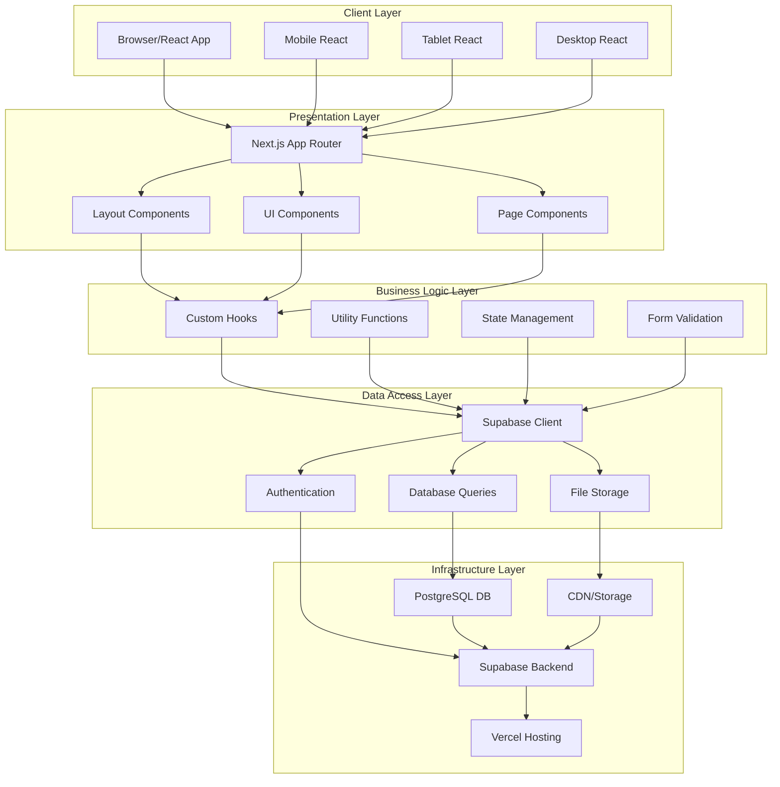
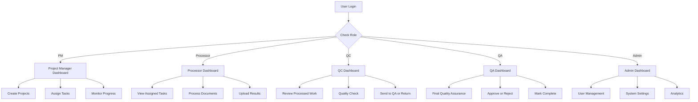
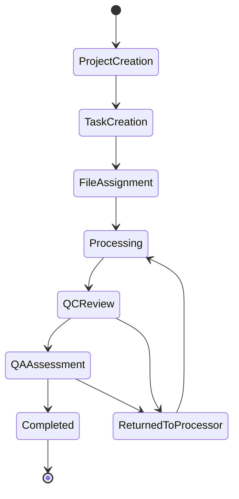
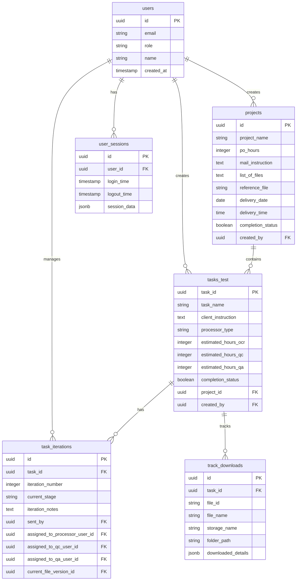
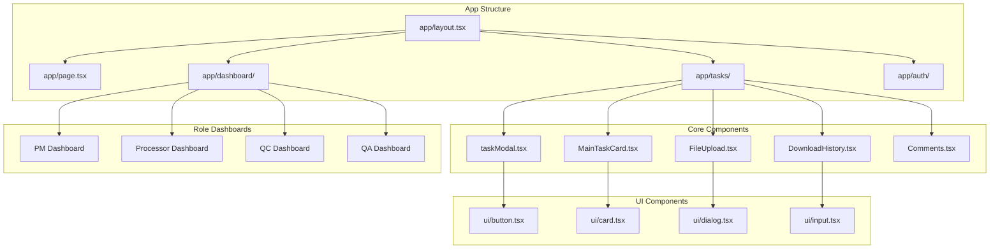
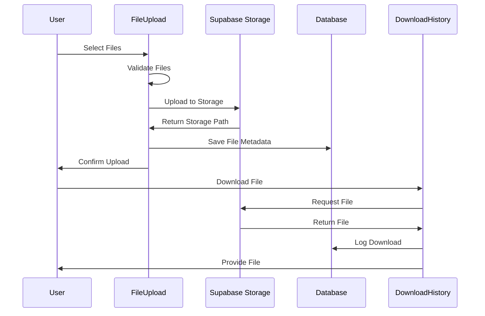
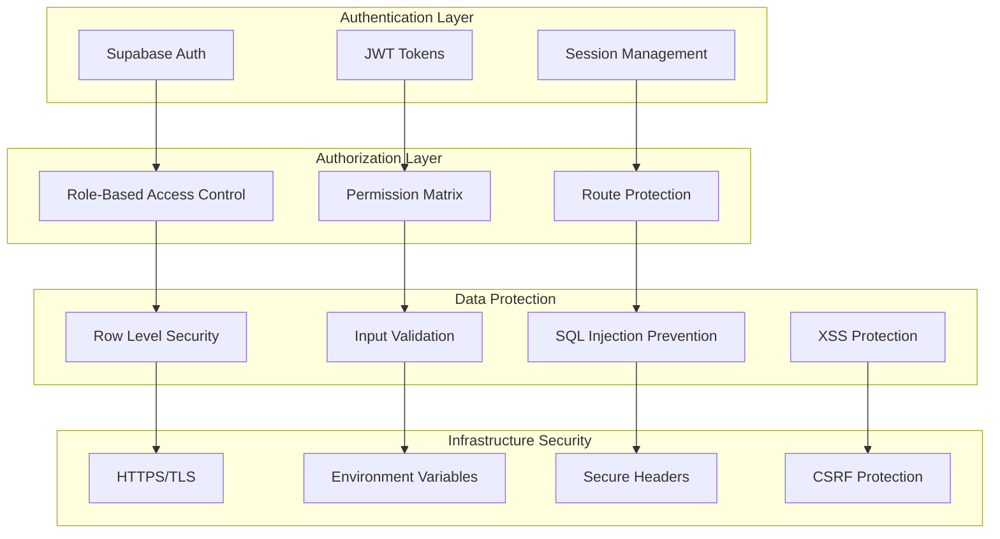
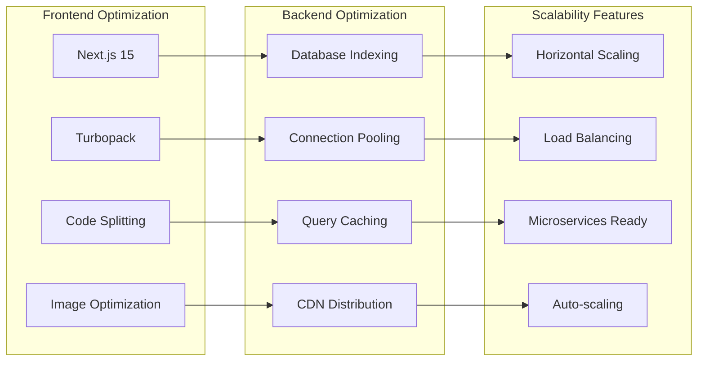

# InfoSpheres System Architecture Diagram

## System Overview Diagram

## User Role Flow Diagram

## Task Workflow Diagram

## Database Schema Diagram

## Component Architecture Diagram

## File Management Flow

## Security Architecture

## Performance & Scalability

These diagrams provide a comprehensive visual representation of the InfoSpheres system architecture, showing the relationships between different components, data flow, user roles, and system design patterns.
